# Workflow: SLO.IngresoPorCompraDeGranos

> **Archivo:** `Molinos.Scato.Workflow/Prod/SLO.IngresoPorCompraDeGranos.xamlx`  
> **ConfigurationName:** `SLO_IngresoPorCompraDeGranos`  
> **Tipo de raíz:** `Flowchart`  
> **Última revisión:** 2026-08-06  
> **Actividades custom:** 62  
> **Variables de scope:** 37  

---

## Descripción general (Overview)

Este workflow modela el proceso completo de **ingreso de granos por compra** en un centro logístico de Molinos Agro. Cubre todo el ciclo operativo desde que un transportista (camión o vagón ferroviario) se presenta a descargar granos hasta que el vehículo sale del establecimiento y se notifican los sistemas regulatorios y contables.

La entidad de dominio central es `CartaPorteDto` (Carta de Porte AFIP), que vincula al transportista, el material, el establecimiento de origen y el centro receptor. El workflow ejecuta:

1. Validación de habilitación del transportista ante el registro interno y AFIP.
2. Calado (muestreo de calidad) y, opcionalmente, análisis de laboratorio.
3. Doble pesada (bruto/tara) en balanza certificada.
4. Cierre del CTG/CPE ante AFIP (`BajaCTG` / `BajaCTGDefinitivo`).
5. Sincronización del cupo y transacción contable con SAP (`ServicioSapInformarCupo`, `ServicioSapFill_Z1000`).
6. Registro de stock en el sistema EPA (`RegistrarStockEpa`).
7. Emisión de todos los documentos de respaldo (constancia de entrega, ticket de pesada, formulario 239, certificado de análisis, etc.).

---

## Punto de entrada (Trigger)

| Atributo | Valor |
|---|---|
| **Actividad inicio** | `CargarCartaPorte` (nodo `__ReferenceID91`, `FlowStep_14`) |
| **Mecanismo** | `Receive` WCF-WF (message correlation por `CorrelationHandle hndInstance`) |
| **Correlación** | El cliente envía el `InstanceId` (GUID) para retomar la instancia persistida |
| **Quién lo invoca** | Operador de balanza / portal web `Molinos.Scato.Web` o `Molinos.Scato.WebOperaciones`, al escanear o ingresar manualmente una Carta de Porte |
| **Output clave** | `CartaPorteDto orden`, `VehiculoDto vehiculo`, `int centroId`, `TipoDocumentoIngreso`, `CorrelationHandle hndInstance`, `Guid instanceId` |

> El workflow es **Flowchart** (no StateMachine): cada actividad avanza linealmente o se bifurca por `FlowDecision` según condiciones de dominio. No hay estados explícitos de larga duración; la persistencia ocurre dentro de cada actividad custom que contiene un `Receive`.

---

## Diagrama del flujo principal

```mermaid
flowchart TD
    START([INICIO]):::trigger

    subgraph ADMISION["① Admisión y validación inicial"]
        A_CCP[CargarCartaPorte\nRECEIVE WCF]
        A_VC[ValidarContrato]
        A_ATA[AsignacionTarjetaDeAcceso]
        A_AE[AsignacionDeEstablecimiento]
        D_REJ{"rechazadoPorStock\nOEstablecimiento?"}
        A_CCD[ConfirmacionDeCargaDescarga]
    end

    subgraph ACCESO["② Control de acceso al centro"]
        A_ITR[IngresoDeTransportista]
        A_VTE[VerificacionTransportistaExiste]
        D_VTE{"existeTransportista?"}
        A_ATI[AutorizarTransportistaInhabilitado]
        D_ATI{"transportistaAutorizado?"}
        A_VTH[VerificacionTransportistaHabilitado]
        D_VTH{"transportistaHabilitado?"}
        A_AUT[AutorizarTiempoEnTransito]
        D_AUT{"autorizarTiempo?"}
        A_ENT[EnTransito]
        A_EPE[EnPlayaExterna]
        A_RECI[ImprimeReciboMunicipal]
    end

    subgraph CTG_BLOCK["③ Gestión CTG / CPE (AFIP)"]
        A_EIE[ImpresionEtiquetaIntacta]
        A_VD[VerificaDestinatarioCTG]
        D_VAG1{"Es Vagón?\n(TipoVehiculo=Tren)"}
        A_BC[BajaCTG]
        A_BCD[BajaCTGDefinitivo]
    end

    subgraph SAP_BLOCK["④ Integración SAP / Stock"]
        A_SSC[ServicioSapInformarCupo]
        A_SSF[ServicioSapFill_Z1000]
        A_RSE[RegistrarStockEpa]
        A_COORD[Coordinacion]
    end

    subgraph CALADO_BLOCK["⑤ Calado y análisis de calidad"]
        D_VAG2{"Es Vagón?"}
        A_CAL[Calado]
        D_VEH_REJ1{"vehiculoRechazado?"}
        A_RCP[RefrescarCartaDePorte]
        A_IMC[ImpresionMuestraCalado]
        A_IMA[ImpresionMuestraAuditoria]
        A_IO[IngresoDeObservaciones]
        D_EAOC{"envioACamara\nObligatorio?"}
        A_EAOC[EnvioACamaraObligatorio]
        A_ILA[ImpresionLoteACamara]
        D_ANAL{"calado.PideAnalisis?"}
        A_ADC[AnalisisDeCalidad]
        A_ICA[ImpresionCertificadoDeAnalisis]
        D_DESC{"TieneDescuentos?"}
        A_EMOD[EnviarMailDescuentos]
        D_ENTG{"Tiene Entregador?"}
        A_ADE[AutorizarDescuentosEntregador]
        D_AUTH{"autorizaEntregador?"}
        A_IAR[ImpresionAsignacionDeRuta]
    end

    subgraph PESADA_BLOCK["⑥ Pesada (Bruto + Tara)"]
        A_PC[PuestoComando]
        A_PB[PesadaBruto]
        A_BAC1[BalanzaACero]
        A_CPM[ControlPesoMaximo]
        D_EPMAX{"excedePesoMaximo?"}
        A_CPO[ControlPesoOrigen]
        A_PT[PesadaTara]
        A_BAC2[BalanzaACero]
        A_AMC[ActualizarMuestraEnvioACamara]
        D_VCAM{"enviaMuestraACamara\nOr envioObligatorio?"}
        A_VCR[VerificacionCamionRechazado]
        D_REP{"debeRepesar?"}
        D_VEH_REJ2{"vehiculoRechazado?"}
    end

    subgraph CIERRE_BLOCK["⑦ Cierre y egreso"]
        A_GFE[GuardarFechaEgreso]
        A_IF239[ImpresionFormulario239]
        A_SCAUT[SalidaDeCentroAutomatica]
        A_SC[SalidaDeCentro]
        A_IDFOS[ImpresionDeclaracionFosfina]
        A_ICCP[ImpresionCertificadoDeCartaPorte]
        A_ICEL[ImpresionConstanciaDeEntregaLaser]
        A_ITP[ImpresionTicketPesada]
    end

    START --> A_CCP
    A_CCP --> A_VC --> A_ATA --> A_AE
    A_AE --> D_REJ
    D_REJ -- Sí / rechazado --> A_CCD
    D_REJ -- No --> A_ITR

    A_ITR --> A_VTE --> D_VTE
    D_VTE -- No existe --> A_ATI --> D_ATI
    D_ATI -- No autorizado --> FIN_REJ([FIN rechazado]):::reject
    D_ATI -- Autorizado --> A_VTH
    D_VTE -- Existe --> A_VTH --> D_VTH
    D_VTH -- No habilitado --> A_AUT --> D_AUT
    D_AUT -- No autoriza --> FIN_REJ
    D_AUT -- Autoriza --> A_ENT --> A_EPE
    D_VTH -- Habilitado --> A_ENT

    A_EPE --> A_RECI --> A_EIE --> A_VD --> D_VAG1
    D_VAG1 -- Vagón --> A_BCD
    D_VAG1 -- Camión --> A_BC
    A_BC --> SAP_BLOCK
    A_BCD --> SAP_BLOCK

    A_RSE --> A_COORD --> A_ILA
    A_SSC --> A_SSF --> A_RSE

    D_VAG2 -- Vagón --> A_CAL
    D_VAG2 -- Camión --> A_CAL
    A_CAL --> D_VEH_REJ1
    D_VEH_REJ1 -- Rechazado --> CIERRE_BLOCK
    D_VEH_REJ1 -- OK --> A_RCP --> A_IMC --> A_IMA --> A_IO

    A_IO --> D_EAOC
    D_EAOC -- Sí --> A_EAOC --> A_ILA
    D_EAOC -- No --> D_ANAL
    A_ILA --> D_ANAL
    D_ANAL -- Sí --> A_ADC --> A_ICA
    D_ANAL -- No --> D_DESC
    A_ICA --> D_DESC
    D_DESC -- Sí --> A_EMOD --> D_ENTG
    D_DESC -- No --> A_IAR
    D_ENTG --> A_ADE --> D_AUTH
    D_AUTH --> A_IAR

    A_IAR --> PESADA_BLOCK
    A_PC --> A_PB --> A_BAC1 --> A_CPM --> D_EPMAX
    D_EPMAX -- Excede --> A_CPO --> A_PT
    D_EPMAX -- OK --> A_PT
    A_PT --> A_BAC2 --> A_AMC --> D_VCAM
    D_VCAM --> A_VCR --> D_VEH_REJ2
    D_VEH_REJ2 -- Rechazado --> CIERRE_BLOCK
    D_VEH_REJ2 -- OK --> D_REP
    D_REP -- Sí --> A_PB
    D_REP -- No --> CIERRE_BLOCK

    CIERRE_BLOCK --> A_GFE --> A_IF239 --> A_SCAUT --> A_SC
    A_SC --> A_IDFOS --> A_ICCP --> A_ICEL --> A_ITP
    A_ITP --> FIN([FIN]):::success

    classDef trigger fill:#2d6a4f,color:#fff,stroke:#1b4332
    classDef reject fill:#c0392b,color:#fff,stroke:#922b21
    classDef success fill:#1a5276,color:#fff,stroke:#154360
```

> **Nota:** El diagrama simplifica algunas ramas paralelas y reutilización de nodos `BalanzaACero`. Ver sección _Etapas del flujo_ para la descripción textual completa.

---

## Etapas del flujo

### ① Admisión y validación inicial

| Actividad | Descripción |
|---|---|
| `CargarCartaPorte` | **Punto de entrada.** Recibe por WCF la Carta de Porte, inicializa `hndInstance`, `orden`, `vehiculo`, `centroId`, `tipoDocumentoIngreso`, `fechaInicio`, `instanceId` y `nombreUsuario`. |
| `ValidarContrato` | Valida que el contrato vinculado a la Carta de Porte tenga cupo disponible y que el material/calidad sea compatible con el establecimiento receptor. |
| `AsignacionTarjetaDeAcceso` | Asigna una tarjeta de acceso RFID al vehículo para habilitar el ingreso físico al predio. |
| `AsignacionDeEstablecimiento` | Asigna el establecimiento de destino dentro del centro (almacén o cámara). Puede rechazar si no hay stock disponible o el establecimiento no está habilitado (`rechazadoPorStockOEstablecimiento`). |
| `EnviarMailStockEstablecimiento` | Notifica por e-mail al coordinador cuando el establecimiento asignado está próximo al límite de capacidad. |
| `ConfirmacionDeCargaDescarga` | Confirma la carga/descarga en caso de rechazo temprano por stock o establecimiento. |

### ② Control de acceso al centro

| Actividad | Descripción |
|---|---|
| `IngresoDeTransportista` | Registra el ingreso físico del transportista al predio; retorna la `CartaPorteDto` actualizada. |
| `VerificacionTransportistaExiste` | Verifica en el repositorio que el `TransportistaId` de la orden exista. Si no existe, deriva a autorización manual. |
| `AutorizarTransportistaInhabilitado` | Solicita al coordinador autorización para un transportista no registrado (recibe observación). |
| `VerificacionTransportistaHabilitado` | Valida habilitación del transportista ante el registro interno: patente, chofer y centro. |
| `AutorizarTiempoEnTransito` | Permite al coordinador extender el tiempo en tránsito cuando se superó el plazo máximo. |
| `EnTransito` | Pone el recorrido en estado _en tránsito_ dentro del predio (entre el ingreso y la balanza). |
| `EnPlayaExterna` | Registra que el vehículo aguarda en playa externa mientras se libera la posición de balanza. |
| `ImprimeReciboMunicipal` | Imprime el recibo municipal cuando la operación lo requiere (`correspondeReciboMunicipal`). |

### ③ Gestión CTG / CPE (AFIP)

| Actividad | Descripción |
|---|---|
| `ImpresionEtiquetaIntacta` | Imprime etiqueta de muestra intacta para trazabilidad AFIP antes del calado. |
| `VerificaDestinatarioCTG` | Verifica que el destinatario del CTG coincida con el establecimiento receptor en Scato. Puede solicitar corrección manual. |
| `BajaCTG` | Cierra el CTG ante AFIP en modo _provisional_ (cuando el camión puede resultar rechazado). Devuelve `rechazado` y `demorado`. |
| `BajaCTGDefinitivo` | Cierra el CTG ante AFIP en modo _definitivo_ (para vagones ferroviarios / flujo directo). |

### ④ Integración SAP / Stock EPA

| Actividad | Descripción |
|---|---|
| `ServicioSapInformarCupo` | Informa a SAP el uso de cupo de compra: envía datos de la Carta de Porte, fechas de pesada y flag de rechazo. |
| `ServicioSapFill_Z1000` | Ejecuta la transacción Z1000 en SAP con todos los datos de pesada, calado, cámara y vehículo para registrar la recepción contable. |
| `RegistrarStockEpa` | Actualiza el stock en el sistema EPA (stock de grano) con los datos del recorrido recién completado. |
| `Coordinacion` | Actividad de coordinación que registra la decisión del coordinador sobre el destino final del grano (`ControlRecorridoDto`). |
| `ImpresionLoteACamara` | Imprime la orden de envío de muestra a cámara arbitral tras la coordinación. |

### ⑤ Calado y análisis de calidad

| Actividad | Descripción |
|---|---|
| `Calado` | Registra el muestreo de calidad (sonda caladora). Produce `CaladoDto calado`, array de `CaladoPorCaracteristicaDto`, flag `enviaACamara` y flag `rechazar` (si el grano no cumple la calidad mínima). |
| `RefrescarCartaDePorte` | Recarga `CartaPorteDto` y `VehiculoDto` desde la base de datos para reflejar cambios realizados durante el calado (ej. correcciones de peso origen). |
| `ImpresionMuestraCalado` | Imprime la muestra de calado para el transportista. |
| `ImpresionMuestraAuditoria` | Imprime la muestra de auditoría (para el corredor y el entregador). |
| `IngresoDeObservaciones` | Permite al operador de balanza ingresar observaciones adicionales sobre el estado del grano o el vehículo. |
| `EnvioACamaraObligatorio` | Registra y procesa el envío de muestra a cámara arbitral cuando es mandatorio por política del centro. |
| `AnalisisDeCalidad` | Gestiona el análisis de calidad en laboratorio cuando `calado.PideAnalisis = true`. Produce `AnalisisPorCaracteristicaDto[]`. |
| `ImpresionCertificadoDeAnalisis` | Imprime el certificado de análisis de laboratorio. |
| `ImpresionSolicitudDeAnalisis` | Imprime la solicitud de análisis enviada al laboratorio. |
| `EnviarMailDescuentos` | Envía un e-mail de notificación de descuentos al área comercial cuando el calado genera bonificaciones. |
| `AutorizarDescuentosEntregador` | Solicita al coordinador la autorización de los descuentos calculados para el entregador. Devuelve `DecisionEntregador`. |
| `ImpresionAsignacionDeRuta` | Imprime la tarjeta de asignación de ruta interna (calle/almacén de destino). |

### ⑥ Pesada (Bruto + Tara)

| Actividad | Descripción |
|---|---|
| `PuestoComando` | Checkpoint de puesto de comando: aguarda confirmación del operador antes de abrir la balanza. |
| `PesadaBruto` | Registra el peso bruto del vehículo cargado. Devuelve `pesoBruto` (kg), `fechaPesoBruto` y `balanzaId`. |
| `BalanzaACero` | Confirma que la balanza está a cero antes/después de cada pesada. Recibe `BalanzaId` y `PuestoId`. |
| `ControlPesoMaximo` | Verifica que el peso bruto no supere el límite legal. Puede ser configurado como _solo notifica_ o _bloquea_. Devuelve `excedePesoMaximo` y `repesar`. |
| `ControlPesoOrigen` | Coteja el peso bruto registrado contra el peso declarado en origen (en la Carta de Porte). Notifica discrepancias. |
| `PesadaTara` | Registra el peso tara del vehículo vacío tras la descarga. Devuelve `pesoTara`, `fechaPesoTara`. |
| `ActualizarMuestraEnvioACamara` | Actualiza la fecha de descarga en la muestra enviada a cámara arbitral. |
| `VerificacionCamionRechazado` | Verifica si el camión debe ser rechazado en balanza por falta de documentación o desvío de peso. Devuelve `camionRechazado`. |

### ⑦ Cierre y egreso

| Actividad | Descripción |
|---|---|
| `GuardarFechaEgreso` | Registra la fecha/hora de egreso del vehículo ejecutando el comando `ModificarFechaEgreso`. |
| `ImpresionFormulario239` | Imprime el Formulario 239 (declaración jurada de recepción AFIP). Puede imprimirse en múltiples etapas del flujo. |
| `SalidaDeCentroAutomatica` | Registra la salida del centro de forma automática cuando el workflow lo permite sin interacción adicional. |
| `SalidaDeCentro` | Registra la salida del centro requiriendo confirmación del operador de portería. |
| `ImpresionDeclaracionFosfina` | Imprime la declaración de fosfina (control fitosanitario) para el transporte de granos. |
| `ImpresionCertificadoDeCartaPorte` | Imprime el certificado de la Carta de Porte con los pesos netos finales. |
| `ImpresionConstanciaDeEntregaLaser` | Imprime la constancia de entrega con firma láser para el transportista. |
| `ImpresionTicketPesada` | Imprime el ticket de balanza certificado (pesada bruto/tara/neto). |

---

## Tabla de referencia de actividades

### Actividades de negocio principales

| Clase de actividad | Responsabilidad | InArguments clave | OutArguments clave |
|---|---|---|---|
| `CargarCartaPorte` | Punto de entrada WCF; carga la Carta de Porte y datos del viaje | _(ninguno: es el Receive inicial)_ | `CartaPorteDto orden`, `VehiculoDto vehiculo`, `int centroId`, `TipoDocumentoIngreso`, `Guid InstanceId`, `CorrelationHandle hndInstance`, `string NombreUsuario`, `int puestoDeTrabajoId`, `bool vehiculoDemorado` |
| `VerificacionTransportistaExiste` | Valida que el transportista de la orden esté registrado | `int? TransportistaId`, `Guid WorkflowId`, `int PuestoDeTrabajoId` | _(result bool vía CodeActivity\<bool\>)_ |
| `VerificacionTransportistaHabilitado` | Valida habilitación del transportista (patente, chofer, centro) | `int centroId`, `int choferId`, `string patente`, `string patenteAcoplado`, `string nombreUsuario`, `Guid workflowId`, `int puestoDeTrabajoId` | `bool transportistaValido` |
| `AutorizarTransportistaInhabilitado` | Solicita autorización manual para transportista no habilitado | `CorrelationHandle hndInstance`, `Guid workflowId`, `int puestoDeTrabajoId`, `string nombreUsuario` | `bool autorizado`, `string Observacion` |
| `Calado` | Registra el calado (muestreo de calidad física del grano) | `CorrelationHandle hndInstance`, `Guid workflowId` | `CaladoDto calado`, `CaladoPorCaracteristicaDto[] caladosPorCaracteristica`, `bool enviaACamara`, `bool rechazar`, `string Observacion`, `int puestoDeTrabajoId` |
| `RefrescarCartaDePorte` | Recarga `CartaPorteDto` y `VehiculoDto` desde BD | `Guid WorkflowId` | `CartaPorteDto Orden`, `VehiculoDto Vehiculo` |
| `AnalisisDeCalidad` | Gestiona análisis de laboratorio del grano | `CorrelationHandle hndInstance`, `Guid workflowId`, `int CaladoId`, `int PesoNetoOrigen` | `AnalisisPorCaracteristicaDto[] caracteristicas`, `int puestoDeTrabajoId`, `string nombreUsuario` |
| `AutorizarDescuentosEntregador` | Solicita autorización de descuentos al coordinador | `CorrelationHandle hndInstance`, `CaladoDto Calado`, `int CentroId`, `Guid workflowId` | `bool DecisionEntregador`, `string NombreUsuario`, `int puestoDeTrabajoId` |
| `PesadaBruto` | Registra el peso bruto en balanza | `CorrelationHandle hndInstance`, `Guid workflowId` | `int peso`, `DateTime fecha`, `int balanzaId`, `int puestoDeTrabajoId`, `bool rechazado` |
| `PesadaTara` | Registra el peso tara en balanza | `CorrelationHandle hndInstance`, `Guid workflowId` | `int peso`, `DateTime fecha`, `int balanzaId`, `int puestoDeTrabajoId`, `bool rechazado` |
| `BalanzaACero` | Confirma balanza en cero antes/después de pesada | `int BalanzaId`, `int PuestoId` | _(void)_ |
| `ControlPesoMaximo` | Verifica límite de peso bruto legal | `CorrelationHandle hndInstance`, `int pesoBruto`, `bool soloNotifica`, `Guid workflowId` | `bool excedePesoMaximo`, `bool repesar`, `string Observacion`, `int puestoDeTrabajoId` |
| `ControlPesoOrigen` | Coteja peso bruto vs peso declarado en origen | _(args de impresión y notificación)_ | _(void, notifica)_ |
| `BajaCTG` | Cierra CTG ante AFIP (modo provisional) | `CorrelationHandle hndInstance`, `CartaPorteDto orden`, `Guid workflowId`, `int centroId`, `VehiculoDto vehiculo` | `bool rechazado`, `bool demorado`, `int puestoDeTrabajoId`, `string nombreUsuario` |
| `BajaCTGDefinitivo` | Cierra CTG ante AFIP (modo definitivo, vagones) | `CorrelationHandle hndInstance`, `CartaPorteDto orden`, `Guid workflowId`, `int centroId`, `VehiculoDto vehiculo` | `int puestoDeTrabajoId`, `string nombreUsuario` |
| `VerificaDestinatarioCTG` | Verifica coincidencia destinatario CTG/Scato | `CorrelationHandle hndInstance`, `CartaPorteDto orden`, `Guid workflowId`, `string nombreUsuario`, `int puestoDeTrabajoId` | _(interacción operador)_ |
| `ServicioSapInformarCupo` | Informa cupo de compra a SAP | `Guid instanceId`, `CartaPorteDto CartaPorte`, `int puestoDeTrabajoId`, `DateTime FechaEgreso/FechaIngreso/FechaPesadaTara`, `bool CamionRechazado` | `string nombreUsuario` |
| `ServicioSapFill_Z1000` | Registra transacción contable Z1000 en SAP | `CaladoDto Calado`, `int PesoBruto/PesoTara/PesoNeto`, `DateTime` múltiples, `TipoVehiculo`, patentes | `int puestoDeTrabajoId`, `string nombreUsuario` |
| `RegistrarStockEpa` | Actualiza stock en sistema EPA | `Guid instanceId`, `CorrelationHandle hndInstance`, `string cosecha` | `int puestoDeTrabajoId`, `string nombreUsuario` |
| `Coordinacion` | Decisión del coordinador sobre destino del grano | `ControlRecorridoDto ControlRecorrido` | `string Observacion` |
| `AsignacionDeEstablecimiento` | Asigna almacén/cámara de destino | `CorrelationHandle hndInstance`, `Guid workflowId`, `int proveedorId` | `bool rechazar`, `bool establecimientoPendiente`, `int puestoDeTrabajoId` |
| `SalidaDeCentro` | Registra egreso del vehículo con confirmación de portería | `CorrelationHandle hndInstance`, `string patente`, `int centroId`, `Guid workflowId` | `int puestoDeTrabajoId`, `string nombreUsuario` |
| `GuardarFechaEgreso` | Persiste la fecha de egreso via `ModificarFechaEgreso` | `Guid WorkflowId`, `int PuestoDeTrabajoId` | `DateTime FechaEgreso` |

---

## Variables de scope

| Nombre | Tipo | Propósito inferido |
|---|---|---|
| `orden` | `CartaPorteDto` | Documento principal: Carta de Porte AFIP del viaje en curso |
| `vehiculo` | `VehiculoDto` | Datos del vehículo (patente, tipo, pesos) |
| `calado` | `CaladoDto` | Resultado del muestreo de calidad (calado) |
| `caladoPorCaracteristica` | `CaladoPorCaracteristicaDto[]` | Detalle de parámetros de calidad por característica |
| `analisisPorCaracteristica` | `AnalisisPorCaracteristicaDto[]` | Resultados del análisis de laboratorio |
| `hndInstance` | `CorrelationHandle` | Handle de correlación WCF para reanudar la instancia |
| `instanceId` | `Guid` | Identificador único de la instancia del workflow |
| `centroId` | `Int32` | ID del centro logístico receptor |
| `ultimoPuestoDeTrabajoId` | `Int32` | Último puesto de trabajo que actuó sobre el workflow |
| `nombreUsuario` | `String` | Usuario activo (por defecto `nombreTest`) |
| `tipoDocumentoIngreso` | `TipoDocumentoIngreso` | Enum: tipo de documento del ingreso (CTG, CPE, etc.) |
| `existeTransportista` | `Boolean` | Flag: transportista registrado en el sistema |
| `transportistaHabilitado` | `Boolean` | Flag: transportista habilitado para operar en el centro |
| `transportistaAutorizado` | `Boolean` | Flag: transportista inhabilitado pero autorizado manualmente |
| `vehiculoRechazado` | `Boolean` | Flag: vehículo rechazado por calado o documentación |
| `camionRechazado` | `Boolean` | Flag: camión rechazado en balanza |
| `pesoBruto` | `Int32` | Peso bruto medido en balanza (kg) |
| `pesoTara` | `Int32` | Peso tara medido en balanza (kg) |
| `fechaPesoBruto` | `DateTime` | Timestamp de la pesada bruta |
| `fechaPesoTara` | `DateTime` | Timestamp de la pesada tara |
| `fechaEgreso` | `DateTime` | Timestamp de salida del centro |
| `fechaInicio` | `DateTime` | Timestamp de inicio del workflow |
| `balanzaId` | `Int32` | ID de la balanza utilizada |
| `excedePesoMaximo` | `Boolean` | Flag: el peso bruto supera el máximo legal |
| `debeRepesar` | `Boolean` | Flag: el camión debe pasar nuevamente por balanza |
| `decisionCoordinador` | `DecisionCoordinacion` | Decisión del coordinador sobre el destino del grano |
| `autorizaEntregador` | `Boolean` | Flag: el coordinador autorizó los descuentos al entregador |
| `autorizarTiempo` | `Boolean` | Flag: el coordinador extendió el tiempo en tránsito |
| `enviaMuestraACamara` | `Boolean` | Flag: operador solicitó envío de muestra a cámara arbitral |
| `envioACamaraObligatorio` | `Boolean` | Flag: el centro exige envío obligatorio a cámara |
| `muestraEnvioACamaraId` | `Int32` | ID de la muestra registrada para envío a cámara |
| `camaraId` | `Int32` | ID de la cámara arbitral receptora |
| `enviaCamara1` | `Boolean` | Flag auxiliar: primera muestra enviada a cámara |
| `observacion` | `String` | Observaciones libres ingresadas por el operador |
| `tolerancia` | `Int32` | Tolerancia de peso aplicada al control de origen (kg) |
| `correspondeReciboMunicipal` | `Boolean` | Flag: la operación requiere recibo municipal |
| `rechazadoPorStockOEstablecimiento` | `Boolean` | Flag: rechazo temprano por falta de stock o establecimiento |

---

## Conceptos de dominio clave

| Concepto | Descripción |
|---|---|
| **Carta de Porte** (`CartaPorteDto`) | Documento AFIP obligatorio para el transporte de granos. Contiene transportista, material, procedencia, destino y pesos declarados. |
| **CTG / CPE** | _Constancia de Transporte de Granos_ (CTG) / _Constancia de Portación Electrónica_ (CPE): manifiestos electrónicos AFIP. `BajaCTG` / `BajaCTGDefinitivo` los cierran al confirmarse la recepción. |
| **Calado** (`CaladoDto`) | Muestreo físico del grano mediante sonda caladora. Determina humedad, proteína, materias extrañas y otros parámetros que definen descuentos y bonificaciones. |
| **Cámara arbitral** | Institución oficial que analiza muestras de granos en disputas comerciales. El workflow puede enviar muestras de forma opcional o mandatoria. |
| **ControlRecorridoDto** | DTO de coordinación que encapsula la decisión del coordinador sobre el destino físico del grano dentro del centro. |
| **EPA** | Sistema de stock externo al que se notifica el ingreso de grano mediante `RegistrarStockEpa`. |
| **SAP Z1000** | Transacción SAP para el registro contable de la recepción de granos: ingresa pesos, calidades y fechas en el sistema ERP. |
| **TipoVehiculo.Tren** | Identifica vagones ferroviarios. Varias `FlowDecision` bifurcan el flujo para tratar vagones diferente de camiones (directo a `BajaCTGDefinitivo`, sin control de peso máximo individual). |
| **PuestoComando** | Checkpoint operativo donde el operador de balanza confirma disponibilidad antes de iniciar la pesada. |
| **Formulario 239** | Declaración jurada de recepción de granos, exigida por AFIP, impresa en múltiples puntos del proceso (rechazo, descarga, egreso). |

---

## Manejo de errores

| Situación | Mecanismo |
|---|---|
| **Transportista no existe** | `existeTransportista = false` → deriva a `AutorizarTransportistaInhabilitado`; si el coordinador no autoriza, el workflow termina con rechazo. |
| **Transportista no habilitado** | `transportistaHabilitado = false` → `AutorizarTiempoEnTransito`; si no se autoriza, fin con rechazo. |
| **Vehículo rechazado en calado** | `vehiculoRechazado = true` → salta directamente al bloque de cierre (imprime Formulario 239 y ejecuta salida). |
| **Camión rechazado en balanza** | `camionRechazado = true` → cierre anticipado con `SalidaDeCentro`. |
| **Excede peso máximo** | `excedePesoMaximo = true` → ejecuta `ControlPesoOrigen` (notificación/bloqueo configurable). |
| **Repesada necesaria** | `debeRepesar = true` → vuelve a `PesadaBruto` en un ciclo. |
| **Rechazo por stock/establecimiento** | `rechazadoPorStockOEstablecimiento = true` → `ConfirmacionDeCargaDescarga` y fin. |
| **Errores en actividades** | Cada `CodeActivity` captura excepciones y registra en `Resultado.Errores`; los errores de log no bloquean el flujo (patrón `try/catch` interno, continúa con advertencia). |
| **Errores de log de actividad** | `CrearLogActividad` y `FinDeActividad` son llamados en cada actividad con `try/catch`; fallos de logging no propagan excepción al workflow host. |
| **Errores SAP/AFIP** | Manejados dentro de `ServicioSapInformarCupo`, `ServicioSapFill_Z1000`, `BajaCTG` y `BajaCTGDefinitivo`; el workflow notifica al operador pero puede continuar según configuración del centro. |

---

## Archivos relacionados

### Workflow
| Archivo | Descripción |
|---|---|
| `Molinos.Scato.Workflow/Prod/SLO.IngresoPorCompraDeGranos.xamlx` | Definición principal del workflow |

### Actividades custom (Molinos.Scato.Actividades)
| Actividad | Archivo fuente |
|---|---|
| `VerificacionTransportistaExiste` | `VerificacionTransportistaExiste.cs` (CodeActivity) |
| `GuardarFechaEgreso` | `GuardarFechaEgreso.cs` (CodeActivity) |
| `RefrescarCartaDePorte` | `Internas/RefrescarCartaDePorte.cs` (CodeActivity) |
| `PuestoComando` | `Internas/PuestoComando.cs` (XAML activity) |
| `VerificacionTransportistaHabilitado` | `VerificacionTransportistaHabilitado.xaml` |
| `CargarCartaPorte` | `CargarCartaPorte.xaml` |
| `Calado` | `Calado.xaml` |
| `AnalisisDeCalidad` | `AnalisisDeCalidad.xaml` |
| `PesadaBruto` | `PesadaBruto.xaml` |
| `PesadaTara` | `PesadaTara.xaml` |
| `BalanzaACero` | `BalanzaACero.xaml` |
| `BajaCTG` | `BajaCTG.xaml` |
| `BajaCTGDefinitivo` | `BajaCTGDefinitivo.xaml` |
| `ServicioSapInformarCupo` | `ServicioSapInformarCupo.xaml` |
| `ServicioSapFill_Z1000` | `ServicioSapFill_Z1000.xaml` |
| `RegistrarStockEpa` | `RegistrarStockEpa.xaml` |
| `Coordinacion` | `Coordinacion.xaml` |
| `AsignacionDeEstablecimiento` | `AsignacionDeEstablecimiento.xaml` |
| `ControlPesoMaximo` | `ControlPesoMaximo.xaml` |
| `IngresoDeTransportista` | `IngresoDeTransportista.xaml` |
| `AutorizarDescuentosEntregador` | `AutorizarDescuentosEntregador.xaml` |
| `SalidaDeCentro` | `SalidaDeCentro.xaml` |
| `ValidarContrato` | `ValidarContrato.xaml` |
| `ActualizarMuestraEnvioACamara` | `ActualizarMuestraEnvioACamara.cs` |
| `EnvioACamaraObligatorio` | `EnvioACamaraObligatorio.xaml` |
| `VerificacionCamionRechazado` | `VerificacionCamionRechazado.xaml` |
| `VerificaDestinatarioCTG` | `VerificaDestinatarioCTG.xaml` |
| `ControlPesoOrigen` | `ControlPesoOrigen.xaml` |

### DTOs y entidades de dominio (Molinos.Scato.Dominio)
| Tipo | Descripción |
|---|---|
| `CartaPorteDto` | DTO central del viaje: transportista, material, pesos, corredor, entregador |
| `VehiculoDto` | Datos del vehículo: patente, acoplado, tipo, pesos |
| `CaladoDto` | Resultado del calado: parámetros de calidad, descuentos, flags |
| `CaladoPorCaracteristicaDto` | Valor de un parámetro de calidad individual del calado |
| `AnalisisPorCaracteristicaDto` | Resultado de laboratorio por característica de calidad |
| `ControlRecorridoDto` | Decisión del coordinador sobre el recorrido del grano |
| `TipoDocumentoIngreso` | Enum: tipo de documento del ingreso (CTG, CPE, remito, etc.) |
| `TipoVehiculo` | Enum: `Camion`, `Tren` (vagón) |
| `DecisionCoordinacion` | Enum: decisión del coordinador (aceptar, rechazar, derivar) |

### Servicios (Molinos.Scato.Servicios)
| Interfaz | Uso en el workflow |
|---|---|
| `IServicioComandos` | Ejecuta comandos de dominio (`CrearLogActividad`, `FinDeActividad`, `ModificarFechaEgreso`, etc.) |
| `IServicioRepositorio` | Consultas de solo lectura (`ObtenerTransportista`, `ObtenerCartaPortePorInstanceId`, `ObtenerVehiculoPorGuid`) |

---

## Workflows relacionados

| Workflow | Relación |
|---|---|
| `SLO.IngresoPorRedespachoDeGranos.xamlx` | Variante de ingreso por redespacho; comparte la mayoría de actividades |
| `SLO.RecepcionClienteFason.xamlx` | Recepción de materia prima Fason; flujo similar sin CTG |
| `SLO.RecepcionesDeTerceros.xamlx` | Recepción por cuenta de terceros; variante sin SAP Z1000 |
| `EgresoPorRedespachoDeGranos.xamlx` | Flujo de egreso complementario al redespacho |
| `CargarCartaPorte.xamlx` | Actividad XAML reutilizada como punto de entrada en varios workflows de ingreso |

---

_Documentación enriquecida manualmente sobre base generada por `AiEnablement/Generate-WfDocs.ps1`. Última actualización: 2026-08-06._