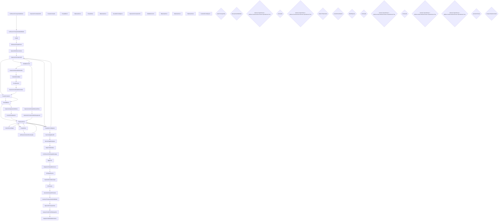

# Workflow: SLO_IngresoPorRedespachoDeGranos

> **Archivo:** `SLO.IngresoPorRedespachoDeGranos.xamlx`  
> **Tipo de raiz:** Flowchart  
> **Generado:** 2026-08-06 18:43  
> **Actividades custom:** 44  
> **Variables de scope:** 26  

## Descripcion de negocio

_TODO: Agregar descripcion del proceso de negocio._

## Variables de scope

| Nombre | Tipo | Valor por defecto |
|--------|------|-------------------|
| `analisisPorCaracteristica` | `AnalisisPorCaracteristicaDto[]` | -- |
| `autorizarTiempo` | `Boolean` | -- |
| `balanzaId` | `Int32` | -- |
| `calado` | `CaladoDto` | -- |
| `caladosPorCaracteristica` | `CaladoPorCaracteristicaDto[]` | -- |
| `centroId` | `Int32` | -- |
| `debeRepesar` | `Boolean` | -- |
| `decisionCoordinacion` | `DecisionCoordinacion` | -- |
| `excedePesoMaximo` | `Boolean` | -- |
| `existeTransportista` | `Boolean` | -- |
| `fechaBruto` | `DateTime` | -- |
| `fechaInicio` | `DateTime` | -- |
| `fechaTara` | `DateTime` | -- |
| `hndInstance` | `CorrelationHandle` | -- |
| `InstanceId` | `Guid` | -- |
| `nombreUsuario` | `String` | NombreTest |
| `observacion` | `String` | -- |
| `orden` | `CartaPorteDto` | -- |
| `pesoBruto` | `Int32` | -- |
| `pesoTara` | `Int32` | -- |
| `rechazado` | `Boolean` | -- |
| `tipoDocumentoIngreso` | `TipoDocumentoIngreso` | -- |
| `transportistaAutorizado` | `Boolean` | -- |
| `transportistaHabilitado` | `Boolean` | -- |
| `ultimoPuestoDeTrabajoId` | `Int32` | -- |
| `vehiculo` | `VehiculoDto` | -- |

## Diagrama del flujo

## Secuencia de actividades

| # | Actividad | Argumentos clave |
|---|-----------|-----------------|
| 1 | `VerificacionTransportistaExiste` | WorkflowId, Result, PuestoDeTrabajoId, TransportistaId |
| 2 | `VerificacionTransportistaHabilitado` | choferId, centroId, patente, workflowId, transportistaValido |
| 3 | `Calado` | calado, hndInstance, rechazar, workflowId, Observacion |
| 4 | `RefrescarCartaDePorte` | workflowId, vehiculo, tipoDocumentoIngreso, puestoDeTrabajoId, orden |
| 5 | `IngresoDeObservaciones` | workflowId, hndInstance, puestoDeTrabajoId, nombreUsuario |
| 6 | `ImpresionFormulario239` | Observaciones, PuestoDeTrabajoId, MaterialId, WorkflowId, CodigoDeImpresion |
| 7 | `PuestoComando` | workflowId, hndInstance, puestoDeTrabajoId, NombreUsuario |
| 8 | `PesadaBruto` | hndInstance, fecha, workflowId, peso, puestoDeTrabajoId |
| 9 | `BalanzaACero` | puestoDeTrabajoId, hndInstance, balanzaId, instanceId, nombreUsuario |
| 10 | `PesadaTara` | hndInstance, fecha, workflowId, peso, puestoDeTrabajoId |
| 11 | `BalanzaACero` | puestoDeTrabajoId, hndInstance, balanzaId, instanceId, nombreUsuario |
| 12 | `GuardarFechaEgreso` | WorkflowId, FechaEgreso, PuestoDeTrabajoId |
| 13 | `ImpresionFormulario239` | Observaciones, PuestoDeTrabajoId, MaterialId, WorkflowId, CodigoDeImpresion |
| 14 | `SalidaDeCentro` | hndInstance, centroId, patente, workflowId, puestoDeTrabajoId |
| 15 | `ImpresionSolicitudDeAnalisis` | Calado, CentroId, WorkflowId, Patente, MaterialId |
| 16 | `AnalisisDeCalidad` | caracteristicas, hndInstance, CaladoId, workflowId, puestoDeTrabajoId |
| 17 | `Coordinacion` | DecisionCoordinacion, CamaraId, observacion, muestraId, workflowId |
| 18 | `ImpresionCertificadoDeAnalisis` | RtteComercial, NumeroIngreso, Calado, PuestoDeTrabajoId, TitularCartaPorte |
| 19 | `PuestoComando` | workflowId, hndInstance, puestoDeTrabajoId, NombreUsuario |
| 20 | `PesadaBruto` | hndInstance, fecha, workflowId, peso, puestoDeTrabajoId |
| 21 | `ImpresionAsignacionDeRuta` | Calado, CentroId, WorkflowId, NumeroDeOrden, MaterialId |
| 22 | `ControlPesoMaximo` | hndInstance, excedePesoMaximo, repesar, workflowId, soloNotifica |
| 23 | `BalanzaACero` | puestoDeTrabajoId, hndInstance, balanzaId, instanceId, nombreUsuario |
| 24 | `ControlPesoOrigen` | puestoDeTrabajoId, NombreUsuario, RtteComercial, hndInstance, pesoBruto |
| 25 | `BalanzaACero` | puestoDeTrabajoId, hndInstance, balanzaId, instanceId, nombreUsuario |
| 26 | `PesadaTara` | hndInstance, fecha, workflowId, peso, puestoDeTrabajoId |
| 27 | `VerificacionCamionRechazado` | hndInstance, Observacion, camionRechazado, workflowId, pesoNeto |
| 28 | `BalanzaACero` | puestoDeTrabajoId, hndInstance, balanzaId, instanceId, nombreUsuario |
| 29 | `GuardarFechaEgreso` | WorkflowId, FechaEgreso, PuestoDeTrabajoId |
| 30 | `ImpresionFormulario239` | Observaciones, PuestoDeTrabajoId, MaterialId, WorkflowId, NumeroDeFormulario |
| 31 | `SalidaDeCentro` | hndInstance, centroId, patente, workflowId, puestoDeTrabajoId |
| 32 | `ImpresionCertificadoDeCartaPorte` | PesoNetoOrigen, PuestoDeTrabajoId, FechaEntrada, NumeroDocumento, WorkflowId |
| 33 | `ImpresionConstanciaDeEntregaLaser` | Vehiculo, CentroId, Observaciones, Orden, WorkflowId |
| 34 | `BalanzaACero` | puestoDeTrabajoId, hndInstance, balanzaId, instanceId, nombreUsuario |
| 35 | `GuardarFechaEgreso` | WorkflowId, FechaEgreso, PuestoDeTrabajoId |
| 36 | `ServicioSapMov305` | hndInstance, nombreUsuario, centroId, tipoComercialId, ejercicio |
| 37 | `ServicioSapMovAjuste` | FechaContab, nombreUsuario, Cantidad, instanceId, ClaseExp |
| 38 | `BajaCTGDefinitivo` | hndInstance, centroId, orden, vehiculo, workflowId |
| 39 | `ConfirmacionDeCargaDescarga` | workflowId, hndInstance, puestoDeTrabajoId, NombreUsuario |
| 40 | `BajaCTG` | hndInstance, centroId, orden, vehiculo, workflowId |
| 41 | `AsignacionTarjetaDeAcceso` | workflowId, hndInstance, puestoDeTrabajoId, nombreUsuario |
| 42 | `EnPlayaExterna` | hndInstance, centroId, patente, workflowId, puestoDeTrabajoId |
| 43 | `ImprimeReciboMunicipal` | workflowId, materialId, puestoDeTrabajoId, centroId, codigoDeImpresion |
| 44 | `EnTransito` | hndInstance, centroId, patente, workflowId, puestoDeTrabajoId |
| 45 | `AutorizarTiempoEnTransito` | autorizado, centroId, codigoControl, patente, workflowId |
| 46 | `AutorizarTransportistaInhabilitado` | autorizado, choferId, centroId, patente, workflowId |
| 47 | `IngresoDeTransportista` | workflowId, CartaPorte, hndInstance, puestoDeTrabajoId, nombreUsuario |
| 48 | `IngresarCartaPorteRedespacho` | hndInstance, tipoDocumentoIngreso, centroId, orden, vehiculo |
| 49 | `AsignacionDeEstablecimiento` | workflowId, proveedorId, hndInstance, puestoDeTrabajoId, nombreUsuario |

**Decisiones de flujo:**

- **Existe Transportista?**: `[existeTransportista]`
- **Transportista Habilitado?**: `[transportistaHabilitado]`
- **Es Vagón?**: `[vehiculo.TipoVehiculo = Molinos.Scato.Dominio.Enums.TipoVehiculo.Tren]`
- **Rechaza Vehículo?**: `[rechazado]`
- **Es Vagón?**: `[vehiculo.TipoVehiculo = Molinos.Scato.Dominio.Enums.TipoVehiculo.Tren]`
- **Pide Analisis?**: `[calado.PideAnalisis]`
- **Excede Peso Máximo?**: `[excedePesoMaximo]`
- **Se Repesa Camión?**: `[debeRepesar]`
- **Vehiculo Rechazado?**: `[rechazado]`
- **Es Vagón?**: `[vehiculo.TipoVehiculo = Molinos.Scato.Dominio.Enums.TipoVehiculo.Tren]`
- **Vehículo Rechazado?**: `[rechazado]`
- **Es Vagón?**: `[vehiculo.TipoVehiculo = Molinos.Scato.Dominio.Enums.TipoVehiculo.Tren]`
- **Es Vagón?**: `[vehiculo.TipoVehiculo = Molinos.Scato.Dominio.Enums.TipoVehiculo.Tren]`
- **¿Autoriza Tiempo?**: `[autorizarTiempo]`
- **Transportista Autorizado?**: `[transportistaAutorizado]`

## Actividades custom referenciadas

> Ensamblado: ``Molinos.Scato.Actividades``

- `AnalisisDeCalidad`
- `AsignacionDeEstablecimiento`
- `AsignacionTarjetaDeAcceso`
- `AutorizarTiempoEnTransito`
- `AutorizarTransportistaInhabilitado`
- `BajaCTG`
- `BajaCTGDefinitivo`
- `BalanzaACero`
- `Calado`
- `ConfirmacionDeCargaDescarga`
- `ControlPesoMaximo`
- `ControlPesoOrigen`
- `Coordinacion`
- `EnPlayaExterna`
- `EnTransito`
- `GuardarFechaEgreso`
- `ImpresionAsignacionDeRuta`
- `ImpresionAsignacionDeRuta.CodigoDeImpresion`
- `ImpresionCertificadoDeAnalisis`
- `ImpresionCertificadoDeAnalisis.CodigoDeImpresion`
- `ImpresionCertificadoDeCartaPorte`
- `ImpresionCertificadoDeCartaPorte.CodigoDeImpresion`
- `ImpresionConstanciaDeEntregaLaser`
- `ImpresionConstanciaDeEntregaLaser.CodigoDeImpresion`
- `ImpresionConstanciaDeEntregaLaser.ObservacionesCalado`
- `ImpresionFormulario239`
- `ImpresionFormulario239.CodigoDeImpresion`
- `ImpresionFormulario239.Representante`
- `ImpresionSolicitudDeAnalisis`
- `ImpresionSolicitudDeAnalisis.CodigoDeImpresion`
- `ImprimeReciboMunicipal`
- `IngresarCartaPorteRedespacho`
- `IngresoDeObservaciones`
- `IngresoDeTransportista`
- `PesadaBruto`
- `PesadaTara`
- `PuestoComando`
- `RefrescarCartaDePorte`
- `SalidaDeCentro`
- `ServicioSapMov305`
- `ServicioSapMovAjuste`
- `VerificacionCamionRechazado`
- `VerificacionTransportistaExiste`
- `VerificacionTransportistaHabilitado`

## Dependencias de dominio

- `Molinos.Scato.Actividades`
- `Molinos.Scato.Dependencias`
- `Molinos.Scato.Dominio`
- `Molinos.Scato.Servicios`
- `Molinos.Scato.Workflow`

---
_Documentacion generada automaticamente por `AiEnablement/Generate-WfDocs.ps1`._