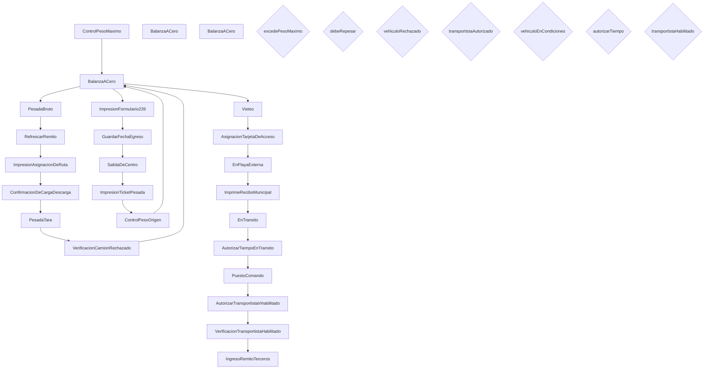

# Workflow: SLO_RecepcionesDeTerceros

> **Archivo:** `SLO.RecepcionesDeTerceros.xamlx`  
> **Tipo de raiz:** Flowchart  
> **Generado:** 2026-08-06 18:43  
> **Actividades custom:** 25  
> **Variables de scope:** 21  

## Descripcion de negocio

_TODO: Agregar descripcion del proceso de negocio._

## Variables de scope

| Nombre | Tipo | Valor por defecto |
|--------|------|-------------------|
| `autorizarTiempo` | `Boolean` | -- |
| `balanzaId` | `Int32` | -- |
| `centroId` | `Int32` | -- |
| `debeRepesar` | `Boolean` | -- |
| `excedePesoMaximo` | `Boolean` | -- |
| `fechaInicio` | `DateTime` | -- |
| `fechaPesoBruto` | `DateTime` | -- |
| `fechaPesoTara` | `DateTime` | -- |
| `hndInstance` | `CorrelationHandle` | -- |
| `instanceId` | `Guid` | -- |
| `nombreUsuario` | `String` | nombreTest |
| `observacion` | `String` | -- |
| `orden` | `RemitoDto` | -- |
| `pesoBruto` | `Int32` | -- |
| `pesoTara` | `Int32` | -- |
| `tipoDocumentoIngreso` | `TipoDocumentoIngreso` | -- |
| `transportistaAutorizado` | `Boolean` | -- |
| `transportistaHabilitado` | `Boolean` | -- |
| `ultimoPuestoDeTrabajoId` | `Int32` | -- |
| `vehiculoEnCondiciones` | `Boolean` | -- |
| `vehiculoRechazado` | `Boolean` | -- |

## Diagrama del flujo

## Secuencia de actividades

| # | Actividad | Argumentos clave |
|---|-----------|-----------------|
| 1 | `ControlPesoMaximo` | hndInstance, excedePesoMaximo, repesar, workflowId, soloNotifica |
| 2 | `BalanzaACero` | puestoDeTrabajoId, hndInstance, balanzaId, instanceId, nombreUsuario |
| 3 | `PesadaBruto` | hndInstance, fecha, workflowId, peso, puestoDeTrabajoId |
| 4 | `RefrescarRemito` | workflowId, tipoDocumentoIngreso, puestoDeTrabajoId, orden |
| 5 | `ImpresionAsignacionDeRuta` | Calado, CentroId, CodigoDeImpresion, Patente, MaterialId |
| 6 | `ConfirmacionDeCargaDescarga` | workflowId, hndInstance, puestoDeTrabajoId, NombreUsuario |
| 7 | `PesadaTara` | hndInstance, fecha, workflowId, peso, puestoDeTrabajoId |
| 8 | `VerificacionCamionRechazado` | hndInstance, Observacion, camionRechazado, workflowId, pesoNeto |
| 9 | `BalanzaACero` | puestoDeTrabajoId, hndInstance, balanzaId, instanceId, nombreUsuario |
| 10 | `ImpresionFormulario239` | Observaciones, PuestoDeTrabajoId, MaterialId, WorkflowId, CodigoDeImpresion |
| 11 | `GuardarFechaEgreso` | WorkflowId, FechaEgreso, PuestoDeTrabajoId |
| 12 | `SalidaDeCentro` | hndInstance, centroId, patente, workflowId, puestoDeTrabajoId |
| 13 | `ImpresionTicketPesada` | Observaciones, PuestoDeTrabajoId, MaterialId, NumeroDocumento, WorkflowId |
| 14 | `ControlPesoOrigen` | puestoDeTrabajoId, NombreUsuario, RtteComercial, hndInstance, pesoBruto |
| 15 | `BalanzaACero` | puestoDeTrabajoId, hndInstance, balanzaId, instanceId, nombreUsuario |
| 16 | `Visteo` | vehiculoEnCondiciones, observacion, workflowId, hndInstance, puestoDeTrabajoId |
| 17 | `AsignacionTarjetaDeAcceso` | workflowId, hndInstance, puestoDeTrabajoId, nombreUsuario |
| 18 | `EnPlayaExterna` | hndInstance, centroId, patente, workflowId, puestoDeTrabajoId |
| 19 | `ImprimeReciboMunicipal` | workflowId, materialId, puestoDeTrabajoId, centroId, codigoDeImpresion |
| 20 | `EnTransito` | hndInstance, centroId, patente, workflowId, puestoDeTrabajoId |
| 21 | `AutorizarTiempoEnTransito` | autorizado, centroId, codigoControl, patente, workflowId |
| 22 | `PuestoComando` | workflowId, hndInstance, puestoDeTrabajoId, NombreUsuario |
| 23 | `AutorizarTransportistaInhabilitado` | autorizado, choferId, centroId, patente, workflowId |
| 24 | `VerificacionTransportistaHabilitado` | choferId, centroId, patente, workflowId, transportistaValido |
| 25 | `IngresoRemitoTerceros` | hndInstance, tipoDocumentoIngreso, centroId, orden, fechaInicio |

**Decisiones de flujo:**

- **Excede Peso Máximo?**: `[excedePesoMaximo]`
- **Se Repesa Vehiculo?**: `[debeRepesar]`
- **Se Rechaza Vehículo?**: `[vehiculoRechazado]`
- **Autoriza?**: `[transportistaAutorizado]`
- **Vehículo En Condiciones?**: `[vehiculoEnCondiciones]`
- **¿Autoriza Tiempo?**: `[autorizarTiempo]`
- **Transportista habilitado?**: `[transportistaHabilitado]`

## Actividades custom referenciadas

> Ensamblado: ``Molinos.Scato.Actividades``

- `AsignacionTarjetaDeAcceso`
- `AutorizarTiempoEnTransito`
- `AutorizarTransportistaInhabilitado`
- `BalanzaACero`
- `ConfirmacionDeCargaDescarga`
- `ControlPesoMaximo`
- `ControlPesoOrigen`
- `EnPlayaExterna`
- `EnTransito`
- `GuardarFechaEgreso`
- `ImpresionAsignacionDeRuta`
- `ImpresionAsignacionDeRuta.Calidad`
- `ImpresionFormulario239`
- `ImpresionFormulario239.Representante`
- `ImpresionTicketPesada`
- `ImprimeReciboMunicipal`
- `IngresoRemitoTerceros`
- `PesadaBruto`
- `PesadaTara`
- `PuestoComando`
- `RefrescarRemito`
- `SalidaDeCentro`
- `VerificacionCamionRechazado`
- `VerificacionTransportistaHabilitado`
- `Visteo`

## Dependencias de dominio

- `Molinos.Scato.Dominio`

---
_Documentacion generada automaticamente por `AiEnablement/Generate-WfDocs.ps1`._